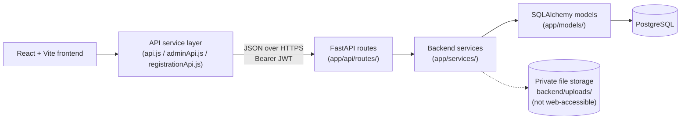

# Student Registration Portal

A full-stack registration and clearance system that replaces a multi-office,
in-person college registration process with an online workflow — built with
React, FastAPI, and PostgreSQL.

## Problem statement

At many colleges, registering for a term means physically visiting seven
different offices in sequence — the Registrar, Health Services, the Success
Center, Financial Aid, the Business Office, Residence Life, and Public
Safety — each one checking its own requirement before a student can move to
the next. That means long lines, paper forms, records that live in seven
different filing systems, and no single place for a student to see where
they actually stand.

This project is inspired by that exact problem at Livingstone College. It
digitizes the parts of the process that can be done online, while keeping
the one step that genuinely requires a physical visit — Public Safety's
student ID processing — as an explicit in-person stage rather than
pretending it can be a form.

## What the system does

A student fills out one online wizard instead of seven paper forms. Each
office reviews and clears its own section from a shared queue. An
administrator creates and manages accounts and can see registration
progress across every office from one dashboard. The backend is the single
source of truth for every status shown anywhere in the app — see
[Security and authorization decisions](#security-and-authorization-decisions).

## Demo / status note

This is a working local build, not a deployed public site. Everything below
runs against a local PostgreSQL database with seeded demo accounts — see
[Local development setup](#local-development-setup). It has not been
deployed to a hosting provider and has not gone through a formal security
review.

## Key features

- Admin-created student and official accounts (no public self-registration)
- A seven-step online registration wizard with save-per-step and resume
- Document upload inside the relevant step, categorized per office
- A seven-office clearance workflow with automatic dependency unlocking
- A Public Safety in-person instruction shown until physical verification
- Per-office review queues with claim, approve, request-correction, and
  reject actions
- An admin dashboard with live counts, per-office progress, recent
  activity, and accounts requiring attention
- Role-based access enforced independently by the backend on every request

## User roles

| Role | What they do | Can create their own account? |
|---|---|---|
| **Student** | Starts/resumes registration, uploads documents, tracks clearance status | No — admin-created |
| **Official** | Reviews their own office's queue, claims and decides on clearances | No — admin-created |
| **Admin** | Creates/manages student and official accounts, assigns offices, views system-wide status | Only the first admin, via seed data — admins cannot create other admins |

## Registration workflow

```
Welcome Desk / Registrar → Health Services → Success Center → Financial Aid
                                                                     ↓
                                                            Business Office
                                                                     ↓
                                            Residence Life (residential only)
                                                                     ↓
                                              Public Safety (in person only)
```

Health Services, Success Center, and Financial Aid open in parallel once the
Registrar approves; Business Office needs Financial Aid; a commuter student
skips Residence Life entirely. Full details in
[docs/WORKFLOW.md](docs/WORKFLOW.md).

## Public Safety: in-person verification

Public Safety is not an online form. The moment a student submits their
registration, the backend creates their Public Safety clearance as
`IN_PERSON_REQUIRED` and returns an explicit instruction telling them to
visit the Public Safety Office once every other clearance is done. That
instruction stays visible on the student's dashboard — driven by the real
clearance status, not a one-time popup — until a Public Safety official
completes the verification in person and the clearance moves to `approved`.
Only then can the application reach `fully_registered`.

## Tech stack

| Layer | Technology |
|---|---|
| Frontend | React + Vite |
| Backend | FastAPI (Python 3.11+) |
| Database | PostgreSQL |
| ORM / migrations | SQLAlchemy + Alembic |
| Auth | Backend-issued JWT, bcrypt password hashing, role-based access control |
| Backend tests | pytest (372 passing integration tests as of this writing) |
| Frontend checks | ESLint, Vite production build |

## Architecture overview



The frontend never connects to PostgreSQL and never holds a database
credential — every read and write goes through an authenticated FastAPI
route. Full breakdown in [docs/ARCHITECTURE.md](docs/ARCHITECTURE.md).

## Frontend/backend data flow

1. A component calls a function in `services/api.js`, `adminApi.js`, or
   `registrationApi.js` — never `fetch()` directly.
2. That function attaches the stored JWT and calls the backend.
3. A FastAPI route checks auth/role, then calls a service function.
4. The service enforces business rules and ownership, then reads/writes
   through SQLAlchemy models.
5. A Pydantic schema controls exactly what comes back — password hashes are
   never on a response schema, so there's no path that could return one.

## Backend API overview

43 routes, grouped by resource: Auth, Admin, Registrations, Applications
(legacy one-shot submission), Documents, Clearances, Official Workspace
(plus the older `Officials` queue route), Students, Audit/Activity,
Notifications, and Health. Full method/route/purpose/access table in
[docs/API_OVERVIEW.md](docs/API_OVERVIEW.md); interactive schema-level docs
at `http://localhost:8000/docs` once the backend is running.

## Database and migrations

PostgreSQL, managed through Alembic. Three migrations exist today: the
initial schema (roles, users, students, officials, applications, courses,
clearances, documents, notifications, audit logs), the addition of
registration drafts and account-management fields, and a fix so a draft
registration gets a real `null` submission timestamp instead of a default
one. Table-by-table detail in [docs/ARCHITECTURE.md](docs/ARCHITECTURE.md)
and [docs/DEVELOPMENT.md](docs/DEVELOPMENT.md#migrations-at-a-glance).

## Security and authorization decisions

- The backend determines role from the database on every request — the
  frontend never sends or is trusted for a role value.
- Every route independently checks authentication and role/ownership;
  hiding a link in the UI is never the actual access control.
- Passwords are hashed with bcrypt and never returned by any API response.
- Admin-created accounts get a one-time temporary password; forcing a
  change on first login is supported by a backend flag but not yet enforced
  by the frontend — see [docs/DECISIONS.md](docs/DECISIONS.md).
- Accounts are deactivated, never deleted.
- A student's own data (applications, documents) is 404, not 403, to any
  other student — existence is never confirmed to a non-owner.

Full reasoning for each of these in [docs/DECISIONS.md](docs/DECISIONS.md).

## Testing and quality checks

- **Backend:** 372 pytest integration tests, run against a real PostgreSQL
  database through FastAPI's `TestClient` — covering auth, every workflow
  path (residential and commuter), access control between roles, and the
  admin/registration/official-workspace routes.
- **Frontend:** `npm run lint` (ESLint) and `npm run build` (production Vite
  build) are both expected to be clean.

## Local development setup

Prerequisites: Python 3.11+, Node.js, PostgreSQL 15+. Full walkthrough with
troubleshooting in [docs/DEVELOPMENT.md](docs/DEVELOPMENT.md) — the short
version is below.

## Environment variables

| File | Variable | Purpose |
|---|---|---|
| `backend/.env` | `DATABASE_URL` | PostgreSQL connection string |
| `backend/.env` | `JWT_SECRET_KEY` | Signs auth tokens — never reuse the example value |
| `backend/.env` | `JWT_ALGORITHM`, `ACCESS_TOKEN_EXPIRE_MINUTES` | Token config |
| `backend/.env` | `CORS_ORIGINS` | Which frontend origins may call the API |
| `backend/.env` | `UPLOAD_DIR` | Where uploaded documents are stored on disk |
| `frontend/.env` | `VITE_API_BASE_URL` | Where the frontend sends API requests |

Both `.env` files are copied from a committed `.env.example` and are
themselves git-ignored. Nothing secret belongs in `VITE_API_BASE_URL` or any
other `VITE_`-prefixed variable — Vite ships those to the browser.

## Run backend

```bash
cd backend
python3.11 -m venv venv
source venv/bin/activate
python -m pip install -r requirements.txt
cp .env.example .env   # then edit DATABASE_URL / JWT_SECRET_KEY
python -m alembic upgrade head
python -m app.scripts.seed_data
python -m uvicorn app.main:app --reload
```

Runs at `http://localhost:8000` (`/docs` for interactive API docs).

## Run frontend

```bash
cd frontend
npm install
npm run dev
```

Runs at `http://localhost:5173`.

## Run tests

```bash
# Backend
cd backend
source venv/bin/activate
pytest -q

# Frontend
cd frontend
npm run lint
npm run build
```

## Project structure

```
registration-portal/
├── README.md                  ← you are here
├── docs/                      ← architecture, API, workflow, dev, decisions
├── backend/
│   ├── app/
│   │   ├── api/routes/        ← one file per resource group
│   │   ├── services/          ← business logic
│   │   ├── models/            ← SQLAlchemy tables
│   │   ├── schemas/           ← Pydantic request/response contracts
│   │   ├── core/               ← config, security, canonical enums
│   │   └── scripts/seed_data.py
│   ├── alembic/versions/      ← migrations, in order
│   ├── tests/                 ← pytest integration tests
│   └── README.md              ← backend-specific setup + curl examples
├── frontend/
│   ├── src/
│   │   ├── pages/             ← Home, Login, StudentPortal, AdminDashboard
│   │   ├── components/
│   │   │   ├── registration/  ← the seven-step wizard
│   │   │   ├── official/      ← Official Workspace
│   │   │   └── admin/         ← Admin Workspace
│   │   └── services/          ← api.js, adminApi.js, registrationApi.js
│   └── docs/design/           ← design-canvas source files
└── Documentation/             ← original project-planning notes (historical — superseded by docs/)
```

## Documentation links

- [docs/ARCHITECTURE.md](docs/ARCHITECTURE.md) — system boundaries, request
  flow, auth, folder guide
- [docs/API_OVERVIEW.md](docs/API_OVERVIEW.md) — every route, grouped, with
  access rules
- [docs/WORKFLOW.md](docs/WORKFLOW.md) — the real end-to-end product flow
- [docs/DEVELOPMENT.md](docs/DEVELOPMENT.md) — setup, running, testing,
  troubleshooting
- [docs/DECISIONS.md](docs/DECISIONS.md) — why the system works this way
- [docs/frontend-architecture-and-design.md](docs/frontend-architecture-and-design.md)
  — frontend structure and design system
- [backend/README.md](backend/README.md) — backend setup plus hand-written
  `curl` examples for the original endpoint groups

## Current status

Implemented and tested: admin account creation and management (student and
official), office assignment, the admin dashboard summary, the full
draft-based registration wizard (start/resume/save-per-step/submit),
document upload inside each step, the seven-clearance workflow with
residential/commuter branching, the Public Safety in-person instruction,
and the official review/claim/decision workflow. See
[docs/API_OVERVIEW.md](docs/API_OVERVIEW.md) for exactly which routes back
each of these.

## Known limitations / future work

- No forced password-change screen yet (the backend flag and endpoint
  exist; nothing in the frontend acts on the flag) — see
  [docs/DECISIONS.md](docs/DECISIONS.md).
- No email notifications or email-based account invitations — every
  notification is in-app only, and a new account's temporary password is
  shared by the admin outside the app.
- No dedicated "resubmit after correction" action — a student addresses a
  correction by re-uploading a document or contacting the office.
- Document storage is local disk, not object storage; no malware scanning
  is wired up (the database has a column reserved for it).
- No concept of a registration deadline or active term window.
- Not deployed; no production security review has been performed.

## Branch workflow

- `main` — stable.
- `develop` — active development; this is where feature branches merge
  after review and testing.
- Feature branches — branch from `develop`, merge back into `develop` when
  done.
- `develop` merges into `main` only once it's stable.

## Author

Francis Suapim
