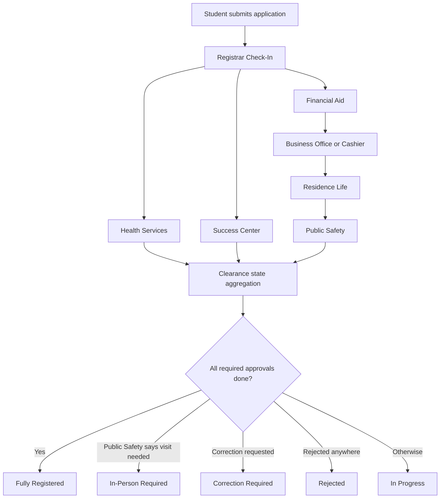

# Database Design for a Routed University Registration and Clearance Portal

## Executive summary

The strongest database design for a routed university registration and clearance portal is not a generic “single table of approvals.” It is a layered design with four clear domains: identity and access, student/application data, workflow state, and event history. In practice, mature workflow engines separate runtime work from identity and history, while security guidance emphasizes that authorization must be checked on every request and should combine role-based control with object ownership and state-based rules. Open-source higher-ed and workflow projects reflect these patterns: RosarioSIS is a student information system built on relational databases; Flowable and Camunda model human tasks, routing, history, and REST APIs; Camunda also separates identity, runtime, and history concerns in its schema. citeturn8view4turn8view5turn8view0turn5view3turn31view0turn31view1turn4view1turn4view0

For your portal, the best near-term architecture is a **relational workflow model implemented in PostgreSQL**, not a full BPM engine on day one. The workflow is relatively stable and school-specific: registrar first, then parallel academic/health/financial review, then business office, then residence life, then public safety. That can be modeled cleanly with an `applications` table, a `clearances` table for per-office tasks, and a small `clearance_dependencies` table that encodes prerequisite edges. This is consistent with BPMN practice: human work is represented as user tasks that wait until completed, concurrency is represented by parallel gateways, and dependency/branching is represented by conditional sequence flows and exclusive gateways. citeturn5view3turn22view3turn22view1turn5view5

Security should be a **hybrid of RBAC plus relationship and attribute checks**. NIST defines RBAC as access control based on user roles, with permissions reflecting organizational functions and role hierarchies. OWASP, however, warns that in real software, pure RBAC is often insufficient by itself; object ownership and state are also critical. In your case, that means: roles determine office membership; relationships determine whether a student owns an application; and attributes determine whether a clearance is currently `Ready`, `Locked`, or `Completed`. Every API request that reads or mutates data should verify all three. citeturn4view0turn5view0turn5view1turn28view0

Auditability is not optional. Mature workflow engines persist operation logs with actor, entity, timestamp, changed property values, and optional annotations. OWASP likewise recommends application logging for audit trails, data changes, policy violations, and investigation support. For your portal, approvals, rejections, correction requests, document uploads, and dependency unlocks should all create append-only `audit_logs` rows, while student- and office-facing updates should create rows in `notifications`. citeturn24view2turn17view0

Document storage should be split between **relational metadata** and **file payload storage**. OWASP recommends changing filenames, restricting upload types and size, and storing files on a different host or at least outside the webroot. AWS S3’s object model supports system-defined metadata, user-defined metadata, tags, and event metadata, which makes it a strong production choice for stored documents; local disk remains acceptable for development or a first on-prem deployment if it is off-webroot and separately backed up. citeturn18view3turn18view0turn18view2turn5view6

Finally, dependency logic should be enforced transactionally, not with clever database `CHECK` constraints. PostgreSQL explicitly warns that `CHECK` constraints should not reference other rows or tables for continuously maintained cross-row rules; those rules belong in `UNIQUE`, `FOREIGN KEY`, triggers, or application transactions. For your workflow, approval of a clearance should happen in one transaction that locks the target clearance and application, writes the review, appends an audit log, unlocks dependent clearances if prerequisites are satisfied, recalculates `overall_status`, and commits. If you later enable real-time UI updates, PostgreSQL `NOTIFY`/`LISTEN` can broadcast an application-changed signal after commit. citeturn15view0turn5view7turn20view0turn20view1turn16view3turn16view4

## What real systems and authoritative guidance point to

Open-source workflow platforms strongly favor a split between **runtime work**, **identity**, and **history**. Camunda’s schema documentation explicitly groups tables into runtime/process, identity, and history areas, and notes that history tables are kept flexible enough that they do not carry foreign-key constraints in the same way operational tables do. This is a useful signal for your own design: keep transactional workflow tables strongly relational, but keep audit/history append-only and somewhat looser so that historical records survive future account or data changes. citeturn31view0turn31view1

Flowable describes itself as a BPM platform with BPMN, CMMN, and DMN engines, deployable in applications, servers, clusters, and the cloud, with Java and REST APIs. That matters because it shows what “mature workflow system” architecture looks like: human tasks, process routing, durable state, APIs, and reporting are usually treated as first-class data structures, not an afterthought hidden inside controller code. citeturn8view0

Camunda’s BPMN guidance is especially relevant to your routing design. A **user task** represents work done by a human; once the process arrives there, the task is created and the process waits until completion. Assignments and forms are part of the task model. A **parallel gateway** forks into multiple concurrent paths and then later joins them. An **exclusive gateway** chooses one branch based on conditions, and a conditional sequence flow can activate downstream paths when a condition is true. Your “registrar then parallel review, then financial-to-business-to-residence-to-public-safety” design maps directly onto these concepts, even if you implement it in your own schema instead of adopting a BPM engine. citeturn5view3turn5view4turn22view3turn22view1turn5view5

On the higher-ed side, RosarioSIS is a useful open-source reference because it shows that student systems in practice remain very relational: it is a full student information system, supports PostgreSQL or MySQL, and includes financial and student-management functions. That makes a PostgreSQL-centered design a reasonable choice for your portal too; you are much closer to a focused SIS workflow extension than to a generic business-process product. citeturn8view4turn8view5

Security guidance strongly supports a hybrid access model. NIST’s RBAC definition emphasizes roles as organizational functions and acknowledges inherited permissions through role hierarchy. OWASP’s Authorization Cheat Sheet adds the operational guardrails: deny by default, enforce least privilege, validate permissions on every request, and protect object identifiers from misuse. OWASP also explicitly notes that ABAC and ReBAC often complement or outperform pure RBAC in real systems. For your portal, that translates into a simple but robust rule set: **RBAC for office membership, ReBAC for “student owns this application,” and attribute/state checks for “is this clearance ready for this office right now?”** citeturn4view0turn5view0turn5view1turn28view0

A second OWASP lesson is especially important for API design: object-level and function-level authorization failures are among the top API risks. Your backend therefore should never trust a front-end dropdown saying “I am Financial Aid.” It should load the authenticated user, derive the actual role from the database, and verify that the target application or clearance row is one that user may access or mutate. citeturn28view0turn4view1

## Authorization and workflow modeling

The cleanest authorization model for this portal is:

- **RBAC** for coarse permissions: student, registrar, health services, success center, financial aid, business office, residence life, public safety, system admin.
- **Relationship checks** for ownership: a student can only access applications where `applications.student_id = current_user.student_profile_id`.
- **Attribute/state checks** for workflow legality: an official can only update a clearance if the row’s `office_role_id` matches the official’s role **and** the clearance’s `availability = 'ready'`. citeturn4view0turn5view0turn5view1turn28view0

This is why a single `status` column is not enough. Designers of routed systems commonly distinguish between the **decision outcome** and the **ability to act**. In your portal, `status` should answer “what has this office decided?” while `availability` should answer “can this office act now?” That prevents Business Office from clicking Approve before Financial Aid finishes and prevents Residence Life from acting before Business Office clears fees.

A practical state model for `clearances` is:

- `status`: `pending`, `approved`, `correction_required`, `rejected`, `in_person_required`, `not_required`
- `availability`: `locked`, `ready`, `completed`, `needs_student_action`

This maps cleanly to human-task workflow concepts and makes queue-building trivial: each office dashboard can filter by `office_role_id` plus `availability/status`, which is exactly how human-task systems expose “worklists.” Camunda’s user-task model and Flowable’s workflow platform are consistent with this task-centric approach. citeturn5view3turn8view0

For your specific school logic, the recommended dependency graph is:



That flow is a direct relational equivalent of BPMN: registrar triggers downstream work; health, success center, and financial aid run in parallel; business, residence, and public safety form a dependent chain. Parallel gateway behavior fits the first branch; conditional unlocks and exclusive branching fit the later stages. citeturn22view3turn22view1turn5view5

A crucial implementation detail is that **dependency rules should be data-driven**. Do not hard-code them in seven different endpoint functions. Put them in a `clearance_dependencies` table, seed them once, and let application code evaluate the graph. PostgreSQL is not the place to express these rules as cross-row `CHECK` constraints, because PostgreSQL warns that `CHECK` constraints should not be used to reference other rows or tables for continuously maintained consistency. Use transactions and, if needed, triggers instead. citeturn15view0

## Recommended SQL schema

The schema below is the recommended baseline for PostgreSQL. It incorporates patterns seen in workflow engines that separate identity, runtime work, and history, while remaining simpler and more application-specific than deploying a full BPM suite. Camunda’s schema separation, Camunda’s user-operation logging model, OWASP’s per-request authorization guidance, and PostgreSQL’s constraint/locking model all support this shape. citeturn31view0turn24view2turn4view1turn15view0turn5view7

### Recommended tables and key attributes

| Table | Key attributes and types | Indexes | Constraints | Notes |
|---|---|---|---|---|
| `roles` | `id smallserial`, `role_key text`, `role_name text`, `role_scope text`, `is_active boolean` | unique on `role_key`, unique on `role_name` | `role_scope` check (`student`,`official`,`admin`) | Seeded roles: `student`, `registrar`, `health_services`, `success_center`, `financial_aid`, `business_office`, `residence_life`, `public_safety`, `system_admin`. |
| `users` | `id uuid`, `email varchar(255)`, `password_hash text`, `account_type text`, `role_id smallint`, `is_active boolean`, `last_login_at timestamptz`, `created_at`, `updated_at` | unique on `lower(email)`, index on `role_id,is_active` | `role_id` FK to `roles`, `account_type` check (`student`,`official`,`admin`) | Real backend should derive role from here; client must never self-select privileged roles. |
| `students` | `id uuid`, `user_id uuid`, `student_no varchar(9)`, `livingstone_email varchar(255)`, `first_name text`, `last_name text`, `classification text`, `major text`, `residency_type text`, `created_at`, `updated_at` | unique on `student_no`, unique on `lower(livingstone_email)`, index on `user_id` | FK `user_id -> users`, regex check for `student_no`, `residency_type` check (`residential`,`commuter`) | Stores student profile separate from auth account. |
| `officials` | `id uuid`, `user_id uuid`, `staff_email varchar(255)`, `first_name text`, `last_name text`, `office_phone text`, `created_at`, `updated_at` | unique on `user_id`, unique on `lower(staff_email)` | FK `user_id -> users` | If one staff member can hold multiple office roles later, add `user_roles` and move role assignment there. |
| `applications` | `id uuid`, `application_number varchar(30)`, `student_id uuid`, `term_code varchar(20)`, `academic_year varchar(9)`, `major text`, `classification text`, `housing_required boolean`, `overall_status text`, `current_step text`, `submitted_at timestamptz`, `created_at`, `updated_at`, `version integer` | unique on `application_number`, index on `student_id,submitted_at desc`, index on `overall_status,current_step`, index on `submitted_at` | FK `student_id -> students`, `overall_status` check | Keep `overall_status` denormalized for fast portal and dashboard reads; `clearances` remain source of truth. |
| `courses` | `id uuid`, `application_id uuid`, `course_code varchar(20)`, `course_title text`, `section varchar(20)`, `credit_hours numeric(4,1)` | index on `application_id`, unique on `(application_id,course_code,section)` | FK `application_id -> applications on delete cascade`, `credit_hours > 0` | Course rows support total-credit validation and auditability. |
| `documents` | `id uuid`, `application_id uuid`, `uploaded_by_user_id uuid`, `document_type text`, `original_filename text`, `stored_filename text`, `storage_backend text`, `storage_key text`, `content_type varchar(255)`, `size_bytes bigint`, `checksum_sha256 char(64)`, `status text`, `version_no integer`, `virus_scan_status text`, `review_message text`, `uploaded_at timestamptz`, `supersedes_document_id uuid`, `metadata jsonb` | index on `application_id,document_type,status`, index on `uploaded_by_user_id`, index on `checksum_sha256` | FKs to `applications`, `users`, optional self-FK on `supersedes_document_id`; `size_bytes > 0`; backend/status checks | Store metadata in DB; store file payload outside DB unless there is a compelling DBA-led reason not to. |
| `clearances` | `id uuid`, `application_id uuid`, `clearance_key text`, `clearance_label text`, `office_role_id smallint`, `status text`, `availability text`, `is_required boolean`, `blocked_reason text`, `reviewed_by_official_id uuid`, `reviewed_at timestamptz`, `message text`, `opened_at timestamptz`, `completed_at timestamptz`, `last_transition_at timestamptz`, `version integer` | unique on `(application_id,clearance_key)`, index on `office_role_id,availability,status`, index on `application_id,status`, index on `reviewed_by_official_id` | FK to `applications`, `roles`, `officials`; checks on `status` and `availability` | This is the core work-queue table. |
| `clearance_dependencies` | `clearance_key text`, `depends_on_clearance_key text`, `unlock_on_status text`, `residential_only boolean`, `is_active boolean` | PK on `(clearance_key,depends_on_clearance_key)`, index on `clearance_key` | check `clearance_key <> depends_on_clearance_key`; `unlock_on_status` normally `approved` | This is a **workflow template** table, not per-application state. |
| `notifications` | `id uuid`, `recipient_user_id uuid`, `recipient_role_id smallint`, `application_id uuid`, `event_type text`, `channel text`, `title text`, `body text`, `payload jsonb`, `delivery_status text`, `is_read boolean`, `read_at timestamptz`, `created_at timestamptz`, `sent_at timestamptz`, `dedupe_key text` | index on `recipient_user_id,is_read,created_at desc`, index on `recipient_role_id,is_read,created_at desc`, unique on `dedupe_key` where not null | FKs to `users`, `roles`, `applications`; checks on `channel` and `delivery_status` | Use for in-app notifications first; later extend to email/SMS delivery. |
| `audit_logs` | `id bigserial`, `occurred_at timestamptz`, `actor_user_id uuid`, `actor_role_id smallint`, `application_id uuid`, `entity_type text`, `entity_id uuid`, `action text`, `reason text`, `success boolean`, `ip_address inet`, `user_agent text`, `request_id uuid`, `before_state jsonb`, `after_state jsonb`, `annotation text` | index on `application_id,occurred_at desc`, index on `actor_user_id,occurred_at desc`, index on `(entity_type,entity_id)`, BRIN or monthly partitioning by `occurred_at` at scale | Prefer `ON DELETE SET NULL` on actor/application FKs if enforced at all | Append-only; think of this as your institution’s defensible review trail. |

### Recommended values for seeded workflow rows

The `clearances` table will hold these seeded `clearance_key` values:

- `registrar_check_in`
- `health_services`
- `success_center`
- `financial_aid`
- `business_office`
- `residence_life`
- `public_safety`

The `clearance_dependencies` table should initially contain:

| clearance_key | depends_on_clearance_key | unlock_on_status | residential_only |
|---|---|---|---|
| `health_services` | `registrar_check_in` | `approved` | `false` |
| `success_center` | `registrar_check_in` | `approved` | `false` |
| `financial_aid` | `registrar_check_in` | `approved` | `false` |
| `business_office` | `financial_aid` | `approved` | `false` |
| `residence_life` | `business_office` | `approved` | `true` |
| `public_safety` | `residence_life` | `approved` | `true` |
| `public_safety` | `business_office` | `approved` | `false` |

That last pair lets you support both residential and commuter flows cleanly: residential students require Residence Life first; commuter students can move from Business Office directly to Public Safety.

### Why this schema shape is better than a simpler one

This design keeps **operational truth** in `clearances` and **display speed** in `applications.overall_status`. It mirrors mature workflow products that separate current work from history, but it remains much leaner than Camunda/Flowable because your process is fixed and domain-specific. It also follows PostgreSQL’s strengths: strong relational constraints for current state, append-only logs for audits, and transactional state transitions with row locks where needed. citeturn31view0turn24view2turn15view0turn5view7

## API design, permission checks, and consistency rules

A clean REST surface for this schema looks like this:

### Authentication and session endpoints

- `POST /auth/login`
- `POST /auth/logout`
- `GET /auth/me`

`POST /auth/login` should accept either student number or student email for students, but backend lookup must still resolve to a single `users` row plus a single `students` profile row. For officials, login should derive the office role from the account in the database, not from client input. That is directly aligned with OWASP’s guidance to validate authorization on every request rather than trusting front-end assumptions. citeturn5view0turn28view0

### Student-facing endpoints

- `GET /students/me`
- `GET /students/me/applications`
- `POST /applications`
- `GET /applications/{application_id}`
- `POST /applications/{application_id}/courses`
- `POST /applications/{application_id}/documents`
- `GET /applications/{application_id}/documents`
- `GET /applications/{application_id}/status`

Permission rule: a student may only access an application if the authenticated `student_id` matches `applications.student_id`. This is a relationship-based authorization check and should be enforced in every query path, not just in UI routing. citeturn5view0turn28view0

### Official-facing endpoints

- `GET /officials/me/queue?availability=ready`
- `GET /officials/me/queue?availability=locked`
- `GET /officials/me/queue?status=completed`
- `GET /applications/{application_id}/review`
- `PATCH /clearances/{clearance_id}`

`PATCH /clearances/{clearance_id}` should be the only mutation endpoint for office review. It should accept a payload like:

```json
{
  "action": "approve",
  "message": "All required financial aid documents verified."
}
```

Valid `action` values should be constrained by role and state:

- registrar/health/success/financial/business/residence: `approve`, `request_correction`, `reject`
- public_safety: `approve`, `request_correction`, `reject`, `mark_in_person_required`

Permission check sequence for `PATCH /clearances/{id}`:

1. Authenticate the user.
2. Load the user’s actual role from the DB.
3. Load the target clearance row.
4. Verify `clearances.office_role_id = current_user.role_id`.
5. Verify `clearances.availability = 'ready'`.
6. Verify current `status` is one of the mutable states.
7. Perform the transition in one transaction.
8. Append audit log and notification rows before commit. citeturn4view1turn5view0turn28view0turn24view2

### Notification and audit endpoints

- `GET /notifications`
- `POST /notifications/{id}/read`
- `GET /audit-logs?application_id=...`
- `GET /audit-logs?entity_type=clearance&entity_id=...`

For student privacy, `GET /audit-logs` should be admin-only by default. Students should see review messages and status changes through the application/clearance representation, not raw institutional audit details.

### Transaction and consistency rules

The most important status-transition rules are:

- A clearance can only move to `approved`, `rejected`, or `correction_required` if it is `ready`.
- A clearance that is `locked` cannot be updated.
- A clearance with unmet prerequisites cannot be auto-unlocked.
- `applications.overall_status` must be recalculated after every successful clearance mutation.
- Document review and clearance review should be separate concepts; documents may be corrected without directly changing all clearances.
- If a transition fails midway, nothing should commit.

PostgreSQL supports this well. Row-level locks block conflicting writers while allowing readers, and they are released at transaction end. For same-application review actions, a safe baseline is to lock the target application row and the target clearance row with `SELECT ... FOR UPDATE`. If you later find more subtle concurrency conflicts, move the transition transaction to `SERIALIZABLE` and implement retry logic for SQLSTATE `40001`, because PostgreSQL explicitly documents serialization failures and retries at that level. citeturn5view7turn16view3turn16view4

A practical rule of thumb is:

- Use `READ COMMITTED` plus targeted row locks for ordinary review actions.
- Use `SERIALIZABLE` only if business rules span multiple rows in ways that can still race under normal locking.
- Keep transactions short, especially if you add PostgreSQL `NOTIFY`, because notifications are delivered only on commit and long transactions delay them. citeturn20view0turn20view1turn16view3

## Example PostgreSQL DDL and example SQL

The following DDL is a practical starting point for the core tables. It uses PostgreSQL types and constraints intentionally: `uuid` for API-safe identifiers, `timestamptz` for auditability, JSONB only where flexible payloads are useful, and explicit `CHECK` constraints for row-local rules. This respects PostgreSQL’s guidance that cross-row business rules should not be expressed through `CHECK` constraints. citeturn15view0

### Core enums and tables

```sql
CREATE EXTENSION IF NOT EXISTS pgcrypto;

CREATE TABLE roles (
    id              smallserial PRIMARY KEY,
    role_key        text NOT NULL UNIQUE,
    role_name       text NOT NULL UNIQUE,
    role_scope      text NOT NULL CHECK (role_scope IN ('student', 'official', 'admin')),
    is_active       boolean NOT NULL DEFAULT true
);

CREATE TABLE users (
    id              uuid PRIMARY KEY DEFAULT gen_random_uuid(),
    email           varchar(255) NOT NULL,
    password_hash   text NOT NULL,
    account_type    text NOT NULL CHECK (account_type IN ('student', 'official', 'admin')),
    role_id         smallint NOT NULL REFERENCES roles(id),
    is_active       boolean NOT NULL DEFAULT true,
    last_login_at   timestamptz,
    created_at      timestamptz NOT NULL DEFAULT now(),
    updated_at      timestamptz NOT NULL DEFAULT now()
);

CREATE UNIQUE INDEX ux_users_email_lower ON users (lower(email));
CREATE INDEX ix_users_role_active ON users (role_id, is_active);

CREATE TABLE students (
    id                  uuid PRIMARY KEY DEFAULT gen_random_uuid(),
    user_id             uuid NOT NULL UNIQUE REFERENCES users(id) ON DELETE CASCADE,
    student_no          varchar(9) NOT NULL UNIQUE,
    livingstone_email   varchar(255) NOT NULL,
    first_name          text NOT NULL,
    last_name           text NOT NULL,
    classification      text,
    major               text,
    residency_type      text NOT NULL DEFAULT 'residential'
                        CHECK (residency_type IN ('residential', 'commuter')),
    created_at          timestamptz NOT NULL DEFAULT now(),
    updated_at          timestamptz NOT NULL DEFAULT now(),
    CONSTRAINT ck_students_student_no_format
        CHECK (student_no ~ '^100[0-9]{6}$')
);

CREATE UNIQUE INDEX ux_students_email_lower ON students (lower(livingstone_email));

CREATE TABLE officials (
    id              uuid PRIMARY KEY DEFAULT gen_random_uuid(),
    user_id         uuid NOT NULL UNIQUE REFERENCES users(id) ON DELETE CASCADE,
    staff_email     varchar(255) NOT NULL,
    first_name      text NOT NULL,
    last_name       text NOT NULL,
    office_phone    text,
    created_at      timestamptz NOT NULL DEFAULT now(),
    updated_at      timestamptz NOT NULL DEFAULT now()
);

CREATE UNIQUE INDEX ux_officials_email_lower ON officials (lower(staff_email));

CREATE TABLE applications (
    id                  uuid PRIMARY KEY DEFAULT gen_random_uuid(),
    application_number  varchar(30) NOT NULL UNIQUE,
    student_id          uuid NOT NULL REFERENCES students(id) ON DELETE RESTRICT,
    term_code           varchar(20) NOT NULL,
    academic_year       varchar(9) NOT NULL,
    major               text NOT NULL,
    classification      text,
    housing_required    boolean NOT NULL DEFAULT true,
    overall_status      text NOT NULL DEFAULT 'in_progress'
                        CHECK (overall_status IN (
                            'in_progress',
                            'correction_required',
                            'rejected',
                            'in_person_required',
                            'fully_registered'
                        )),
    current_step        text NOT NULL DEFAULT 'registrar_check_in',
    submitted_at        timestamptz NOT NULL DEFAULT now(),
    created_at          timestamptz NOT NULL DEFAULT now(),
    updated_at          timestamptz NOT NULL DEFAULT now(),
    version             integer NOT NULL DEFAULT 1
);

CREATE INDEX ix_applications_student_submitted
    ON applications (student_id, submitted_at DESC);

CREATE INDEX ix_applications_status_step
    ON applications (overall_status, current_step);

CREATE TABLE courses (
    id              uuid PRIMARY KEY DEFAULT gen_random_uuid(),
    application_id  uuid NOT NULL REFERENCES applications(id) ON DELETE CASCADE,
    course_code     varchar(20) NOT NULL,
    course_title    text NOT NULL,
    section         varchar(20) NOT NULL,
    credit_hours    numeric(4,1) NOT NULL CHECK (credit_hours > 0),
    created_at      timestamptz NOT NULL DEFAULT now(),
    UNIQUE (application_id, course_code, section)
);

CREATE INDEX ix_courses_application ON courses (application_id);

CREATE TABLE documents (
    id                      uuid PRIMARY KEY DEFAULT gen_random_uuid(),
    application_id          uuid NOT NULL REFERENCES applications(id) ON DELETE CASCADE,
    uploaded_by_user_id     uuid NOT NULL REFERENCES users(id) ON DELETE RESTRICT,
    document_type           text NOT NULL,
    original_filename       text NOT NULL,
    stored_filename         text NOT NULL,
    storage_backend         text NOT NULL CHECK (storage_backend IN ('local', 's3')),
    storage_key             text NOT NULL,
    content_type            varchar(255) NOT NULL,
    size_bytes              bigint NOT NULL CHECK (size_bytes > 0),
    checksum_sha256         char(64),
    status                  text NOT NULL DEFAULT 'uploaded'
                            CHECK (status IN ('uploaded', 'approved', 'needs_correction', 'rejected')),
    version_no              integer NOT NULL DEFAULT 1,
    virus_scan_status       text NOT NULL DEFAULT 'pending'
                            CHECK (virus_scan_status IN ('pending', 'clean', 'infected', 'failed')),
    review_message          text,
    uploaded_at             timestamptz NOT NULL DEFAULT now(),
    supersedes_document_id  uuid REFERENCES documents(id) ON DELETE SET NULL,
    metadata                jsonb NOT NULL DEFAULT '{}'::jsonb
);

CREATE INDEX ix_documents_app_type_status
    ON documents (application_id, document_type, status);

CREATE TABLE clearances (
    id                      uuid PRIMARY KEY DEFAULT gen_random_uuid(),
    application_id          uuid NOT NULL REFERENCES applications(id) ON DELETE CASCADE,
    clearance_key           text NOT NULL,
    clearance_label         text NOT NULL,
    office_role_id          smallint NOT NULL REFERENCES roles(id),
    status                  text NOT NULL DEFAULT 'pending'
                            CHECK (status IN (
                                'pending',
                                'approved',
                                'correction_required',
                                'rejected',
                                'in_person_required',
                                'not_required'
                            )),
    availability            text NOT NULL DEFAULT 'locked'
                            CHECK (availability IN (
                                'locked',
                                'ready',
                                'completed',
                                'needs_student_action'
                            )),
    is_required             boolean NOT NULL DEFAULT true,
    blocked_reason          text,
    reviewed_by_official_id uuid REFERENCES officials(id) ON DELETE SET NULL,
    reviewed_at             timestamptz,
    message                 text,
    opened_at               timestamptz,
    completed_at            timestamptz,
    last_transition_at      timestamptz NOT NULL DEFAULT now(),
    version                 integer NOT NULL DEFAULT 0,
    UNIQUE (application_id, clearance_key)
);

CREATE INDEX ix_clearances_queue
    ON clearances (office_role_id, availability, status, reviewed_at);

CREATE INDEX ix_clearances_app_status
    ON clearances (application_id, status);

CREATE TABLE clearance_dependencies (
    clearance_key               text NOT NULL,
    depends_on_clearance_key    text NOT NULL,
    unlock_on_status            text NOT NULL DEFAULT 'approved'
                                CHECK (unlock_on_status IN ('approved')),
    residential_only            boolean NOT NULL DEFAULT false,
    is_active                   boolean NOT NULL DEFAULT true,
    PRIMARY KEY (clearance_key, depends_on_clearance_key),
    CONSTRAINT ck_clearance_dependencies_not_self
        CHECK (clearance_key <> depends_on_clearance_key)
);

CREATE TABLE notifications (
    id                  uuid PRIMARY KEY DEFAULT gen_random_uuid(),
    recipient_user_id   uuid REFERENCES users(id) ON DELETE CASCADE,
    recipient_role_id   smallint REFERENCES roles(id) ON DELETE SET NULL,
    application_id      uuid REFERENCES applications(id) ON DELETE CASCADE,
    event_type          text NOT NULL,
    channel             text NOT NULL CHECK (channel IN ('in_app', 'email')),
    title               text NOT NULL,
    body                text NOT NULL,
    payload             jsonb NOT NULL DEFAULT '{}'::jsonb,
    delivery_status     text NOT NULL DEFAULT 'pending'
                        CHECK (delivery_status IN ('pending', 'sent', 'failed', 'read')),
    is_read             boolean NOT NULL DEFAULT false,
    read_at             timestamptz,
    created_at          timestamptz NOT NULL DEFAULT now(),
    sent_at             timestamptz,
    dedupe_key          text
);

CREATE UNIQUE INDEX ux_notifications_dedupe
    ON notifications (dedupe_key) WHERE dedupe_key IS NOT NULL;

CREATE INDEX ix_notifications_user_unread
    ON notifications (recipient_user_id, is_read, created_at DESC);

CREATE TABLE audit_logs (
    id              bigserial PRIMARY KEY,
    occurred_at     timestamptz NOT NULL DEFAULT now(),
    actor_user_id   uuid REFERENCES users(id) ON DELETE SET NULL,
    actor_role_id   smallint REFERENCES roles(id) ON DELETE SET NULL,
    application_id  uuid REFERENCES applications(id) ON DELETE SET NULL,
    entity_type     text NOT NULL,
    entity_id       uuid,
    action          text NOT NULL,
    reason          text,
    success         boolean NOT NULL DEFAULT true,
    ip_address      inet,
    user_agent      text,
    request_id      uuid,
    before_state    jsonb,
    after_state     jsonb,
    annotation      text
);

CREATE INDEX ix_audit_logs_application_time
    ON audit_logs (application_id, occurred_at DESC);

CREATE INDEX ix_audit_logs_actor_time
    ON audit_logs (actor_user_id, occurred_at DESC);
```

### Example query for creating an application and default clearances

This example inserts one application, its courses, and its seeded clearances in a single transaction. It assumes `roles` and `clearance_dependencies` have already been seeded.

```sql
BEGIN;

WITH new_app AS (
    INSERT INTO applications (
        application_number,
        student_id,
        term_code,
        academic_year,
        major,
        classification,
        housing_required,
        overall_status,
        current_step
    )
    VALUES (
        :application_number,
        :student_id,
        :term_code,
        :academic_year,
        :major,
        :classification,
        :housing_required,
        'in_progress',
        'registrar_check_in'
    )
    RETURNING id, housing_required
),
course_rows AS (
    INSERT INTO courses (application_id, course_code, course_title, section, credit_hours)
    SELECT
        new_app.id,
        c.course_code,
        c.course_title,
        c.section,
        c.credit_hours
    FROM new_app
    CROSS JOIN (
        VALUES
            ('CSC101', 'Intro to Computing', 'A', 3.0),
            ('ENG111', 'College Writing', 'B', 3.0),
            ('MAT121', 'College Algebra', 'C', 3.0),
            ('BIO101', 'General Biology', 'D', 3.0),
            ('HIS101', 'World History', 'E', 3.0)
    ) AS c(course_code, course_title, section, credit_hours)
    RETURNING 1
),
seeded_clearances AS (
    INSERT INTO clearances (
        application_id,
        clearance_key,
        clearance_label,
        office_role_id,
        status,
        availability,
        is_required,
        blocked_reason,
        opened_at
    )
    SELECT
        new_app.id,
        t.clearance_key,
        t.clearance_label,
        r.id,
        CASE
            WHEN t.clearance_key = 'residence_life' AND new_app.housing_required = false
                THEN 'not_required'
            ELSE 'pending'
        END AS status,
        CASE
            WHEN t.clearance_key = 'registrar_check_in'
                THEN 'ready'
            WHEN t.clearance_key = 'residence_life' AND new_app.housing_required = false
                THEN 'completed'
            ELSE 'locked'
        END AS availability,
        CASE
            WHEN t.clearance_key = 'residence_life' AND new_app.housing_required = false
                THEN false
            ELSE true
        END AS is_required,
        CASE
            WHEN t.clearance_key = 'registrar_check_in'
                THEN NULL
            WHEN t.clearance_key = 'residence_life' AND new_app.housing_required = false
                THEN 'Not required for commuter student'
            ELSE 'Waiting on prerequisite clearance'
        END AS blocked_reason,
        CASE
            WHEN t.clearance_key = 'registrar_check_in' THEN now()
            ELSE NULL
        END AS opened_at
    FROM new_app
    CROSS JOIN (
        VALUES
            ('registrar_check_in', 'Registrar Check-In Clearance', 'registrar'),
            ('health_services',    'Health / Immunization Clearance', 'health_services'),
            ('success_center',     'Academic / Course Registration Clearance', 'success_center'),
            ('financial_aid',      'Financial Aid Clearance', 'financial_aid'),
            ('business_office',    'Business Office / Payment Validation', 'business_office'),
            ('residence_life',     'Housing / Residence Life Clearance', 'residence_life'),
            ('public_safety',      'Public Safety / ID Clearance', 'public_safety')
    ) AS t(clearance_key, clearance_label, role_key)
    JOIN roles r ON r.role_key = t.role_key
    RETURNING application_id
)
INSERT INTO audit_logs (
    actor_user_id,
    application_id,
    entity_type,
    entity_id,
    action,
    annotation
)
SELECT
    s.user_id,
    a.id,
    'application',
    a.id,
    'application_created',
    'Student created a new registration application'
FROM new_app a
JOIN students s ON s.id = a.student_id;

COMMIT;
```

This approach keeps application creation atomic. It is exactly the kind of multi-row consistency that belongs in a transaction, not in UI-only logic. PostgreSQL’s documentation on constraints and transaction isolation strongly supports this pattern. citeturn15view0turn16view3

### Example query for approving a clearance, unlocking dependents, and recalculating overall status

This example shows the core workflow mutation. It verifies role ownership, updates the target clearance, unlocks any dependents whose prerequisites are now satisfied, recalculates application status, appends an audit log, and emits a PostgreSQL notification that will be delivered on commit.

```sql
BEGIN;

-- Lock the target clearance and parent application row
WITH target AS (
    SELECT c.id,
           c.application_id,
           c.clearance_key,
           c.office_role_id,
           c.availability,
           c.status,
           o.id AS official_id,
           o.user_id AS official_user_id
    FROM clearances c
    JOIN officials o
      ON o.id = :official_id
    WHERE c.id = :clearance_id
    FOR UPDATE
),
locked_app AS (
    SELECT a.*
    FROM applications a
    JOIN target t ON t.application_id = a.id
    FOR UPDATE
),
authorized_update AS (
    UPDATE clearances c
    SET status = 'approved',
        availability = 'completed',
        reviewed_by_official_id = :official_id,
        reviewed_at = now(),
        message = :message,
        completed_at = now(),
        last_transition_at = now(),
        version = c.version + 1
    FROM target t
    WHERE c.id = t.id
      AND t.office_role_id = :official_role_id
      AND t.availability = 'ready'
      AND t.status IN ('pending', 'correction_required')
    RETURNING c.application_id, c.clearance_key
),
unlock_dependents AS (
    UPDATE clearances d
    SET availability = 'ready',
        blocked_reason = NULL,
        opened_at = COALESCE(d.opened_at, now()),
        last_transition_at = now(),
        version = d.version + 1
    FROM authorized_update u
    WHERE d.application_id = u.application_id
      AND d.availability = 'locked'
      AND EXISTS (
            SELECT 1
            FROM clearance_dependencies cd
            WHERE cd.clearance_key = d.clearance_key
              AND cd.is_active = true
      )
      AND NOT EXISTS (
            SELECT 1
            FROM clearance_dependencies cd
            JOIN clearances prereq
              ON prereq.application_id = d.application_id
             AND prereq.clearance_key = cd.depends_on_clearance_key
            WHERE cd.clearance_key = d.clearance_key
              AND cd.is_active = true
              AND prereq.status <> cd.unlock_on_status
      )
      AND NOT (
            d.clearance_key = 'residence_life'
            AND EXISTS (
                SELECT 1
                FROM applications a2
                WHERE a2.id = d.application_id
                  AND a2.housing_required = false
            )
      )
    RETURNING d.application_id, d.clearance_key
),
recalc AS (
    UPDATE applications a
    SET overall_status = CASE
            WHEN EXISTS (
                SELECT 1 FROM clearances c
                WHERE c.application_id = a.id
                  AND c.is_required = true
                  AND c.status = 'rejected'
            ) THEN 'rejected'
            WHEN EXISTS (
                SELECT 1 FROM clearances c
                WHERE c.application_id = a.id
                  AND c.is_required = true
                  AND c.status = 'correction_required'
            ) THEN 'correction_required'
            WHEN EXISTS (
                SELECT 1 FROM clearances c
                WHERE c.application_id = a.id
                  AND c.clearance_key = 'public_safety'
                  AND c.status = 'in_person_required'
            )
            AND NOT EXISTS (
                SELECT 1 FROM clearances c
                WHERE c.application_id = a.id
                  AND c.is_required = true
                  AND c.clearance_key <> 'public_safety'
                  AND c.status <> 'approved'
            ) THEN 'in_person_required'
            WHEN NOT EXISTS (
                SELECT 1 FROM clearances c
                WHERE c.application_id = a.id
                  AND c.is_required = true
                  AND c.status <> 'approved'
            ) THEN 'fully_registered'
            ELSE 'in_progress'
        END,
        current_step = COALESCE((
            SELECT c.clearance_key
            FROM clearances c
            WHERE c.application_id = a.id
              AND c.availability = 'ready'
            ORDER BY c.opened_at NULLS FIRST, c.clearance_key
            LIMIT 1
        ), 'completed'),
        updated_at = now(),
        version = a.version + 1
    WHERE a.id = (SELECT application_id FROM target)
    RETURNING a.id, a.overall_status, a.current_step
)
INSERT INTO audit_logs (
    actor_user_id,
    actor_role_id,
    application_id,
    entity_type,
    entity_id,
    action,
    annotation,
    after_state
)
SELECT
    t.official_user_id,
    :official_role_id,
    r.id,
    'clearance',
    :clearance_id,
    'clearance_approved',
    :message,
    jsonb_build_object(
        'overall_status', r.overall_status,
        'current_step', r.current_step
    )
FROM recalc r
JOIN target t ON true;

SELECT pg_notify(
    'application_updates',
    json_build_object(
        'application_id', (SELECT id FROM recalc),
        'event', 'clearance_approved'
    )::text
);

COMMIT;
```

This query pattern follows PostgreSQL’s transaction and notification semantics: row locks prevent conflicting writes, and `NOTIFY` events are only delivered if the transaction commits. If you instead choose `SERIALIZABLE`, PostgreSQL requires retry handling on serialization failures. citeturn5view7turn20view0turn16view4

## File storage, notifications, audit logging, and operations

### Document storage approach

OWASP’s file-upload guidance is clear: change filenames to application-generated values, store files on a different host if possible, otherwise outside the webroot, validate size and type, and require appropriate authorization. It also notes that storing files inside the database is possible but introduces performance and backup tradeoffs and should be chosen deliberately, not casually. citeturn18view3turn18view0turn18view2

That leads to two realistic options for your portal.

| Approach | Pros | Cons | Recommendation |
|---|---|---|---|
| Local filesystem | Simple to implement; good for development or single-server pilot; easy direct access for admins | Harder to scale across multiple app servers; host loss can lose files if backups are weak; must stay outside webroot; permissions must be carefully managed | Good for local development and an early campus pilot with one server |
| S3 or S3-compatible object storage | Cleanly separates app and file host; supports system metadata, user metadata, tags, and event metadata; easier for multi-instance deployments and long-term storage governance | More integration work; signed URL/download flow needed; DB row and object write are separate operations, so you need reconciliation logic | Best long-term production choice |

AWS S3’s metadata model is useful here. S3 maintains system-defined metadata, allows user-defined metadata and tags, and records event metadata. A subtle but important detail is that user-defined metadata is not mutable in place after upload; to change it, you typically replace or copy the object. That is a good reason to keep business review status in the database rather than treating object metadata as your system of record. citeturn5view6

### Recommended document metadata

For every uploaded file, store at least:

- `application_id`
- `document_type`
- `original_filename`
- `stored_filename`
- `storage_backend`
- `storage_key`
- `content_type`
- `size_bytes`
- `checksum_sha256`
- `uploaded_by_user_id`
- `uploaded_at`
- `status`
- `review_message`
- `version_no`
- `virus_scan_status`
- `metadata jsonb`

That set supports review workflows, safe download naming, integrity verification, redelivery, and document replacement history.

### Notification table design

For phase one, `notifications` should support **in-app alerts** first and email later. The right pattern is to store notifications as durable rows, then have a worker or API layer mark them `sent` or `read`. PostgreSQL `LISTEN`/`NOTIFY` works well for lightweight real-time UI refresh, but it should not replace durable notification rows because `NOTIFY` is signaling, not archival messaging. PostgreSQL says the payload is limited, notifications are delivered only between transactions, and they should remain lightweight. citeturn20view0turn20view1

A good rule is:

- `notifications` = durable user-facing message history.
- `pg_notify` = optional wake-up signal to websocket worker or UI listener.
- Email/SMS delivery = asynchronous worker updating `delivery_status`.

### Audit and logging model

OWASP recommends application logging for security events and explicitly includes audit trails for data addition, modification, deletion, exports, and policy violations. It also recommends that application logs include actor identity, roles/permissions, context, target, action, and outcomes where possible. Camunda’s user-operation log goes further by storing operation id, operation type, entity type, entity ids, user id, timestamp, changed property, old/new values, and optional business annotations. That is a strong template for your `audit_logs` table. citeturn17view0turn24view2

For your portal, log at least these events:

- login success/failure
- application created
- course list changed
- document uploaded / document replaced
- document status changed
- clearance approved / rejected / correction requested / in-person required
- dependency unlocked
- overall status changed
- notification created / sent / failed

Keep `audit_logs` append-only. Do not edit old log entries except to add a clearly separate annotation if institutional policy requires it.

### Scalability and backup considerations

From PostgreSQL’s perspective, backups fall into three big families: SQL dump, filesystem-level backup, and continuous archiving. For a real campus portal, SQL dump alone is not enough once the system becomes operational. You want at minimum routine logical backups for portability plus WAL-based continuous archiving or another point-in-time recovery plan. citeturn16view2

Recommended operational posture:

- **Development**: local PostgreSQL backups plus filesystem backups of local documents.
- **Pilot**: nightly logical dump, daily filesystem snapshot, off-host copy of uploaded files.
- **Production**: automated database backups with point-in-time recovery, documented restore testing, separate file-payload backup policy, and periodic checksum validation on document metadata.

For scale, put indexes only on queue-critical and lookup-critical columns. PostgreSQL reminds that indexes speed reads but add write overhead and maintenance cost. In this system, the most valuable indexes are on student application lookup, office queue lookup, unread notifications, and time-ordered audit logs. citeturn16view0turn15view0

As volume grows, the first tables likely to need partitioning are:

- `audit_logs` by month or quarter
- `notifications` by month if volume is very high
- possibly `documents` metadata if uploads become large and long-lived

Keep in mind that workflow engines often relax foreign keys in history tables to preserve flexibility and reduce coupling. Your portal can keep stronger relations than Camunda on current-state tables, but a lighter-touch approach on `audit_logs` is usually wise. citeturn31view1

## Implementation roadmap

The most practical implementation order is:

### Foundation phase

Deliverables:
- PostgreSQL database
- migrations for all tables above
- seeded `roles`
- seeded `clearance_dependencies`
- seeded office-role-to-clearance mapping in code

Tests:
- migration up/down
- uniqueness and FK constraint tests
- seeded workflow integrity test

### Identity and authorization phase

Deliverables:
- `users`, `students`, `officials`, `roles`
- password hashing
- login endpoint
- `GET /auth/me`
- authorization middleware

Tests:
- student can access own application only
- official role is derived from DB, not request payload
- unauthorized object access returns 403
- inactive accounts cannot log in

### Application submission phase

Deliverables:
- `POST /applications`
- course insertion
- 15-credit validation
- default clearance creation
- initial audit log

Tests:
- fewer than 15 credits rejected
- residential vs commuter behavior handled correctly
- default clearances seeded with correct initial `availability`

### Office workflow phase

Deliverables:
- official queue endpoints
- `PATCH /clearances/{id}`
- dependency unlock logic
- overall status recalculation
- audit logging

Tests:
- registrar unlocks parallel offices
- business office blocked until financial aid approval
- residence life blocked until business office approval
- public safety blocked until residence life for residential students
- commuter flow bypasses residence life correctly
- wrong office cannot mutate another office’s clearance

### Documents and notifications phase

Deliverables:
- document upload endpoint
- local-storage or S3 adapter
- `notifications` rows
- optional `pg_notify` integration
- unread/read APIs

Tests:
- upload validation
- filename randomization
- unauthorized file access blocked
- notification created after review action
- notification read state works

### Audit, operations, and recovery phase

Deliverables:
- structured audit log query
- backup scripts
- restore runbook
- retention policy
- admin metrics for queue counts and status counts

Tests:
- replay important workflow events from audit log
- restore database backup to clean environment
- verify document metadata consistency after restore
- load-test queue queries and approval endpoint

### Frontend integration phase

Deliverables:
- replace localStorage with API calls
- backend-backed session/auth
- official queue and student portal backed by real DB
- document uploads via backend

Tests:
- end-to-end registration submission
- end-to-end office review chain
- student sees only own data
- full approval results in `fully_registered`
- public safety `in_person_required` behaves correctly

The central design recommendation is concise: **use PostgreSQL as the transactional source of truth, keep workflow state in `clearances`, keep dependency rules in `clearance_dependencies`, keep display summaries in `applications`, store files outside the database, and treat audit logs as append-only institutional evidence.** That design is simpler than adopting a BPM engine immediately, but it is still aligned with how mature workflow systems, student systems, and security guidance structure the problem. citeturn31view0turn24view2turn18view2turn5view0turn4view0