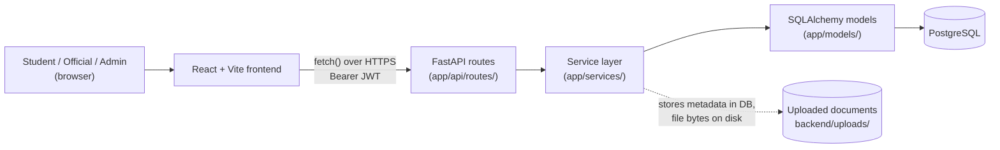

# Architecture

## The three layers

The frontend never talks to PostgreSQL, and never sees a database
credential. Every read and write goes through a FastAPI route, which is the
only thing with a `DATABASE_URL`. This isn't a style preference — it's the
actual security boundary: the backend re-checks ownership and role on every
request regardless of what the UI shows or hides (see [DECISIONS.md](./DECISIONS.md)).

## Request flow

A typical authenticated request:

1. The frontend calls a function in `frontend/src/services/api.js`,
   `adminApi.js`, or `registrationApi.js` — never a raw `fetch()` scattered
   inside a component.
2. That function calls the shared `request()`/`requestForm()` helper in
   `api.js`, which prefixes `VITE_API_BASE_URL`, attaches the stored JWT as
   `Authorization: Bearer <token>`, and normalizes error bodies into one
   `ApiError` shape (`.message`, `.status`, `.detail`).
3. A FastAPI route in `backend/app/api/routes/` receives the request. Its
   only job is authentication/authorization (via `Depends(deps....)`) and
   translating the HTTP request into a call on the service layer.
4. A function in `backend/app/services/` holds the actual business logic —
   validation, workflow rules, audit logging, notification creation. Routes
   stay thin on purpose so the rules live in one place, not scattered across
   route handlers.
5. Services query/write through SQLAlchemy models in `backend/app/models/`,
   which map directly to PostgreSQL tables.
6. The response is serialized through a Pydantic schema in
   `backend/app/schemas/` — this is what actually controls what a client can
   see. Password hashes, for example, are never on any response schema, so
   there's no code path that could leak one.

## Auth and session flow

- `POST /auth/login` accepts a student ID, student email, or staff email
  plus a password. The backend resolves which of those formats it is and
  looks up the matching `User` row — the frontend never tells the backend
  what role the identifier belongs to.
- On success the backend issues a JWT (`app/core/security.py`) containing
  the user's ID, `account_type`, and `role_key`. The frontend stores it in
  `localStorage` and sends it back as a Bearer token on every request.
- `GET /auth/me` re-reads the *current* database row for that user on every
  call — a role or active-status change takes effect immediately, it isn't
  cached in the token itself. Every protected route depends on
  `app/api/deps.py` helpers (`get_current_user`, `require_admin`,
  `require_official`, `get_current_student`, …) that hit the database, not
  just the token claims.
- A 401 on any authenticated request clears the stored token and fires a
  browser event the frontend listens for, so an expired/invalid session
  drops the user back to a logged-out state everywhere at once instead of
  failing one screen at a time.

## Role-based access

Three `account_type` values exist: `student`, `official`, `admin`. An
official also carries a `role_key` naming their one primary office
(`registrar`, `health_services`, `success_center`, `financial_aid`,
`business_office`, `residence_life`, `public_safety`) — see
[DECISIONS.md](./DECISIONS.md) for why that's a fixed enum, not free text.

Authorization is enforced **only** in the backend:

- Route-level: FastAPI dependencies reject the wrong `account_type` or role
  before a service function ever runs (`require_admin`, `require_official`,
  `require_official_or_admin`, `require_student`).
- Row-level: services re-check ownership on every read/write — a student
  requesting another student's application gets a 404 (not a 403, so the
  response never confirms the other application even exists); an official
  acting on a clearance outside their own office gets a 403.

The frontend mirrors these rules in its navigation (hiding links a role
can't use, guarding routes, redirecting to the right workspace) purely for a
better user experience. That mirroring is never the actual security
boundary — a hidden link or client-side redirect is convenience, not
protection, and every route above still enforces its own rule
independently of what the UI happens to show.

## Backend folders

| Folder | Holds |
|---|---|
| `app/api/routes/` | One file per resource group — HTTP-layer only: parse the request, check auth, call a service, return the response. |
| `app/api/deps.py` | The shared auth/role dependencies every protected route depends on. |
| `app/services/` | Business logic: validation, the clearance workflow state machine, audit logging, notifications, document storage. |
| `app/models/` | SQLAlchemy ORM models — one class per table. |
| `app/schemas/` | Pydantic request/response models — the actual contract with the frontend. |
| `app/core/` | Cross-cutting config: settings (`config.py`), password hashing/JWT (`security.py`), the canonical office enum (`enums.py`). |
| `app/scripts/seed_data.py` | Idempotent seed script — roles, clearance dependency rules, and (development only) demo accounts. |
| `alembic/versions/` | One migration file per schema change, in order. |
| `tests/` | Integration tests that run against a real Postgres database via `TestClient` (see [DEVELOPMENT.md](./DEVELOPMENT.md)). |

## Frontend folders

| Folder | Holds |
|---|---|
| `src/pages/` | Top-level routed pages: `Home.jsx`, `Login.jsx`, `StudentPortal.jsx`, `AdminDashboard.jsx` (which itself renders either the Official Workspace or, for an admin session, `AdminWorkspace.jsx`). |
| `src/components/registration/` | The seven-step registration wizard, its per-step components, and the state/adapter logic that talks to `/registrations/*`. |
| `src/components/official/` | The Official Workspace's dashboard, review panel, and confirmation dialog. |
| `src/components/admin/` | The Admin Workspace's dashboard, user management, account forms, and office assignment screens. |
| `src/components/` (top level) | Shared chrome and primitives used by more than one workspace: `Navbar`, `Footer`, `ProfileMenu`, `StatusBadge`, `WorkspaceNav`, `DocumentList`, `ActivityTimeline`, `NotificationBell`. |
| `src/services/` | `api.js` (the shared request helper plus every legacy/shared endpoint call), `adminApi.js`, `registrationApi.js` — see [API_OVERVIEW.md](./API_OVERVIEW.md) for what each function calls. |
| `src/utils/` | Small pure helpers: route constants, safe-redirect-path checking, backend enum → label mapping. |

See [frontend-architecture-and-design.md](./frontend-architecture-and-design.md)
for the design system itself (visual language, layout patterns,
accessibility conventions).

## Document upload and storage

A document upload is a `multipart/form-data` POST carrying a
`document_type` and a file. The backend (`app/services/document_service.py`):

1. Validates the extension, content-type, and size against fixed allow-lists
   (see [API_OVERVIEW.md](./API_OVERVIEW.md)).
2. Sanitizes the filename and writes the file to
   `backend/uploads/documents/application_{id}/` under a generated, unique
   name — the student's original filename is kept only as a display label,
   never as the path on disk.
3. Records the file as a `Document` row (type, size, checksum, uploader,
   version number) — the row is the metadata, the file itself lives on
   disk, and a raw file path is never included in any API response.
4. Re-uploading the same `document_type` for the same application creates a
   new version linked via `supersedes_document_id`, rather than silently
   overwriting the original.

`backend/uploads/` is local disk storage and is excluded from git. This is
what's actually implemented — there is no object storage (S3 or similar)
and no virus/malware scanning wired up; `document_service.py` has an
unused `virus_scan_status` column reserved for that, and the storage
function is written so a future swap to S3 wouldn't need to touch the
database rows. Both are future work, not current behavior.

## Where the two `.env` files fit

- **`backend/.env`** (copy of `backend/.env.example`, never committed) —
  read by `app/core/config.py` via `pydantic-settings`. Holds
  `DATABASE_URL`, `JWT_SECRET_KEY`, `JWT_ALGORITHM`,
  `ACCESS_TOKEN_EXPIRE_MINUTES`, `CORS_ORIGINS`, and `UPLOAD_DIR`. This is
  the only place database credentials exist.
- **`frontend/.env`** (copy of `frontend/.env.example`, also not committed)
  — read by Vite at build/dev time. The only variable is
  `VITE_API_BASE_URL`, consumed in exactly one place
  (`frontend/src/services/api.js`) to build every request URL. If it's
  unset, `api.js` falls back to `http://localhost:8000`.

Vite exposes every `VITE_`-prefixed variable to client-side JavaScript by
design, so nothing secret should ever be put in a `VITE_` variable — see
[DEVELOPMENT.md](./DEVELOPMENT.md).
